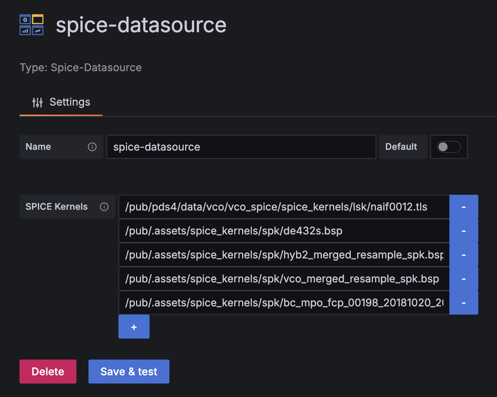
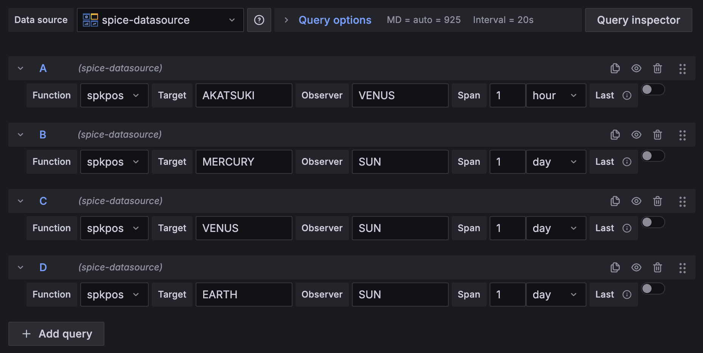

# dartsisas-spice-datasource

Grafana data source plugin that lets you visualize and analyze SPICE data.

## What is SPICE?

SPICE is a system of data products and tools provided by the Navigation and Ancillary Information Facility (NAIF) at NASA/JPL. It supplies geometric and temporal information about spacecraft and celestial bodies for mission planning, orbit determination, attitude calibration, and related analyses. The SPICE toolkit works with "kernels" such as SPK (ephemerides), CK (attitude), SCLK/LSK (time conversions), and DSK (shape models). See the NAIF website (<https://naif.jpl.nasa.gov/naif/>) for complete documentation.

This plugin exposes vectors and other outputs derived from SPICE kernels so that you can combine them with Grafana panels for mission monitoring and analysis workflows.

## Plugin Options

### Data source configuration



- **SPICE Kernels**: Register the URLs of the kernel files the data source depends on. Use `+` to add new entries and `-` to remove them. Kernels are loaded from top to bottom, so order them to match temporal or dependency requirements.

- **Bodies Source**: Choose how to obtain the list of available celestial bodies.
  - `Enumerate from Kernels`: Enumerate bodies from loaded SPK kernels (default)
  - `JSON File`: Load body list from an external JSON file

- **Bodies JSON URL** (when Bodies Source is JSON File): Specify the URL of a JSON file containing the body list.
  Default: `http://localhost:3031/spice-bodies.json`

- **Enumerate Ranges** (when Bodies Source is Enumerate from Kernels): Specify NAIF ID ranges to enumerate. The default ranges cover common celestial bodies. Add or remove ranges as needed.

- **Enumerate Test Times** (when Bodies Source is Enumerate from Kernels): Specify test times (ISO 8601 format) to check body positions. If empty, the current time is used. Useful for spacecraft with limited SPK coverage.

### Query configuration



- **Function**: Choose the NAIF utility to call. The plugin currently supports `spkpos` (target/observer position vector).

- **Target**: When `spkpos` is selected, set the target body name or NAIF ID you want to retrieve. Select from common bodies or enter a custom value. Valid body IDs are displayed in green, invalid ones in red.

- **Observer**: When `spkpos` is selected, set the observing body name or NAIF ID. Select from common bodies or enter a custom value. Valid body IDs are displayed in green, invalid ones in red.

- **Frame**: Specify the reference frame for calculations. Available frames:
  - `J2000`: Earth Mean Equator and Equinox of J2000 (default)
  - `ECLIPJ2000`: Ecliptic coordinates based on J2000
  - `GALACTIC`: Galactic System II coordinates
  - `IAU_EARTH`: Earth body-fixed frame
  - `IAU_MARS`: Mars body-fixed frame
  - `IAU_SUN`: Sun body-fixed frame

- **Range Source**: Specify how to obtain the time range.
  - `Grafana Range`: Use Grafana UI time range (default)
  - `Custom Range`: Specify custom time range

- **Start Time / End Time** (when Range Source is Custom Range): Specify the start and end times in ISO 8601 format. Example: `2024-01-01T00:00:00Z`

- **Calculation**: Specify the calculation mode.
  - `Span Intervals`: Calculate at specified intervals (default)
  - `End Point Only`: Calculate only at the end point

- **Span** (when Calculation is Span Intervals): Specify the sampling interval. Calculations are processed from the end time toward the start at the specified interval. This ensures that the end point ("current time") has a calculated result. Units: `sec`, `min`, `hour`, `day`

- **Output**: Specify the output format.
  - `Cartesian (x,y,z)`: Output position as x, y, z coordinates (default)
  - `Quaternion`: Output rotation as quaternion (q0,q1,q2,q3)
  - `Euler XYZ`: Output rotation as Euler angles (roll, pitch, yaw)
  - `Euler ZYX`: Output rotation as Euler angles (yaw, pitch, roll)
  - `Euler ZXZ`: Output rotation as Euler angles (precession, nutation, spin)

### Screenshots

- [Data source](./screenshots/datasource.png)
- [Query](./screenshots/query.png)

## Development

### Local server

Steps to start a local development server:

Prerequisites: Docker environment must be set up. Note firewall settings to access the local server from a browser.

1. Start build server: `pnpm dev`
2. Start Grafana development server: `docker compose up`
3. Access `http://localhost:3000` in browser

Grafana server automatically tries to load the data source under development, so start the build server first.

### Loading kernel data

The data source loads kernel data in the browser. Therefore, kernel data must be on the same domain or served from a CORS-enabled server.

For local testing, you need a local distribution server.

For example, using Node's http-server:

```sh
npx http-server -p 3030 --cors ./data
```

### Data source configuration

Specify kernel data in the data source settings.

Multiple kernels can be specified. For example, for spkpos calculations:

* http://localhost:3030/kernels/lsk/naif0012.tls
* http://localhost:3030/kernels/spk/de432s.bsp

## Build

Run `pnpm build` to build. A make command is also provided to create a tar.gz archive:

```sh
make dist
```

## Dependencies

* rxjs
* timecraftjs

## Body list configuration

The list of bodies selectable for Target and Observer is provided as an external JSON file.

### Configuration file placement

Serve `spice-bodies.json` via HTTP server:

```sh
npx http-server -p 3031 --cors ./data
```

Specify Bodies JSON URL in data source settings:
- Default: `http://localhost:3031/spice-bodies.json`

### Generating spice-bodies.json

A tool is provided to automatically generate `spice-bodies.json` from SPK kernel files.

See [`tools/spice-bodies-generator/README.md`](./tools/spice-bodies-generator/README.md) for details.

**Quick start:**

```bash
# Install CSPICE (first time only)
cd tools/spice-bodies-generator
./install-cspice.sh

# Build tool
go build

# Generate spice-bodies.json
./spice-bodies-generator -lsk ../../data/kernels/lsk/naif0012.tls \
                          -o ../../data/spice-bodies.json \
                          ../../data/kernels/spk/*.bsp
```

Generated `spice-bodies.json` format:

```json
{
  "bodies": [
    {"id": 0, "name": "SOLAR SYSTEM BARYCENTER"},
    {"id": 1, "name": "MERCURY BARYCENTER"},
    {"id": 199, "name": "MERCURY"},
    ...
  ]
}
```

### Build necessity

Since the body list is dynamically loaded as external JSON, there is no need to rebuild the plugin after configuration changes.

## License

Licensed under the GNU Lesser General Public License v3.0.

© 2025 ISAS/JAXA and [NAKAHIRA, Satoshi](https://orcid.org/0000-0001-9307-046X).

## Acknowledgement

This software was developed with the cooperation of [AstroArts Inc.](https://www.astroarts.co.jp/)
