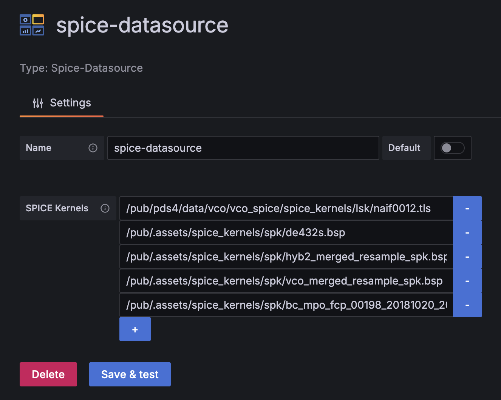
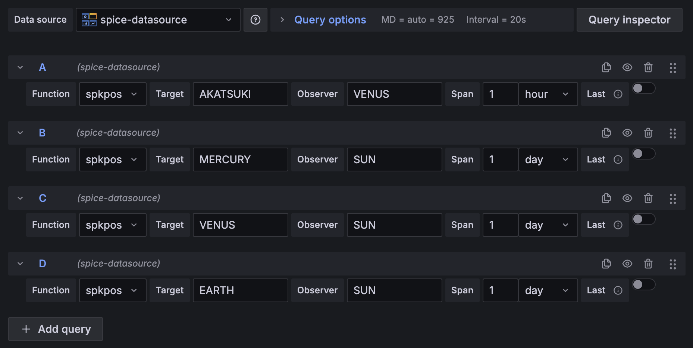

# dartsisas-spice-datasource

SPICE データを Grafana で可視化・分析するためのデータソースプラグインです。

## SPICE とは

SPICE は NASA/JPL の Navigation and Ancillary Information Facility (NAIF) が提供する、宇宙探査機や天体に関する幾何学的・時間的情報を扱うためのデータシステムとツール群です。ミッション計画や軌道解析、指向校正などに必要な「カーネル (kernel)」と呼ばれるファイルに、天体位置 (SPK)、姿勢 (CK)、時刻変換 (SCLK、LSK)、形状モデル (DSK) といったデータを保持します。詳細は NAIF の公式サイト (<https://naif.jpl.nasa.gov/naif/>) を参照してください。

このプラグインは、SPICE カーネルから取得できる位置ベクトルなどの情報を Grafana の可視化パネルで取り扱えるようにし、運用監視やミッション分析に活用できるようにします。

## プラグインオプション

### データソース設定

- `SPICE Kernels`: 依存するカーネルファイルの URL を複数登録します。`+` ボタンで入力欄を追加し、`-` ボタンで不要なエントリを削除します。順番は上から読み込まれるため、時系列や依存関係がある場合は適切な順に並べてください。

### クエリ設定

- `Function`: 使用する NAIF ユーティリティ関数を選択します。現在は `spkpos` (ターゲットと観測者の位置ベクトル) と `spkezr` (指定された照会コードに基づく状態ベクトル) をサポートしています。
- `Target`: `spkpos` 選択時、位置を取得したいターゲット天体名または ID を指定します。
- `Observer`: `spkpos` 選択時、観測点となる天体名または ID を指定します。
- `Span`: `spkpos` 選択時、クエリで取得するサンプル間隔を数値で設定します。右側のセレクタで単位 (`sec`/`min`/`hour`/`day`) を指定できます。
- `Last`: 最新のデータポイント 1 件のみが必要な場合に有効化します。オンにすると `Span` 入力が無効化され、リフレッシュ時に常に最新値が取得されます。
- `spkezr` を選択した場合は追加パラメータが現時点では存在せず、指定された関数のデフォルト条件でクエリが実行されます。

## ライセンス
GNU Lesser General Public License v3.0 の下で提供されています。

著作者: ISAS/JAXA and [NAKAHIRA, Satoshi](https://orcid.org/0000-0001-9307-046X) (© 2025)。

## 謝辞
本ソフトウェアは[株式会社アストロアーツ](https://www.astroarts.co.jp/)の協力のもと開発されました。

